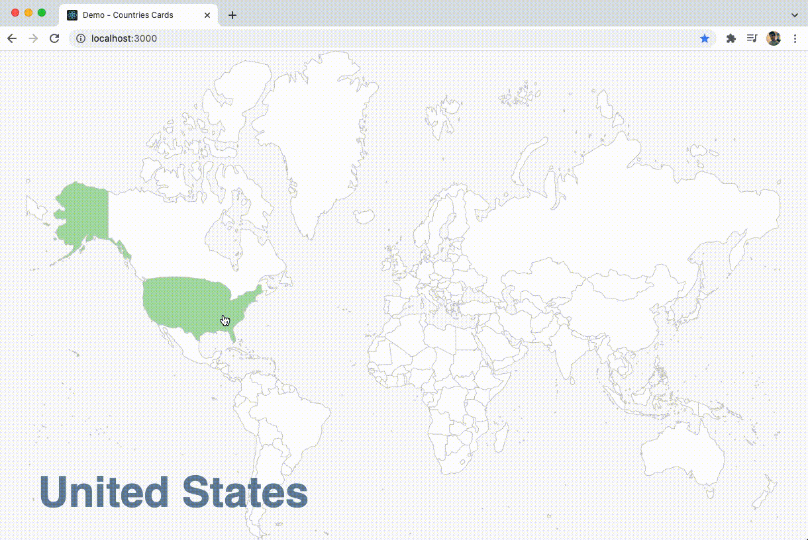

# demo-countries-cards

A very basic demo application but still useful to understand **how to** visualize a _map.geojson_ file using D3.js and React.
The purpose of this project is to show how to use D3.js just to generate the _svg paths_ and React for rendering them.

## Usage

To install the dependencies and execute the project, open your terminal and run:

```
npm install
npm start
```

To execute some _Unit Tests_ just run:

```
npm test
```

If you want to see some _Acceptance Tests_, run the demo in one terminal window then, run this in a different one

```
npm cypress:open
```
 


## Built With

[React](https://reactjs.org/) •
[TypeScript](https://www.typescriptlang.org/) •
[D3.js](https://d3js.org/) •
[Styled-Components](https://styled-components.com/) •
[Jest](https://jestjs.io/) •
[Testing-Library](https://testing-library.com/) •
[Cypress](https://www.cypress.io/)

## License

This project is under the MIT license.
